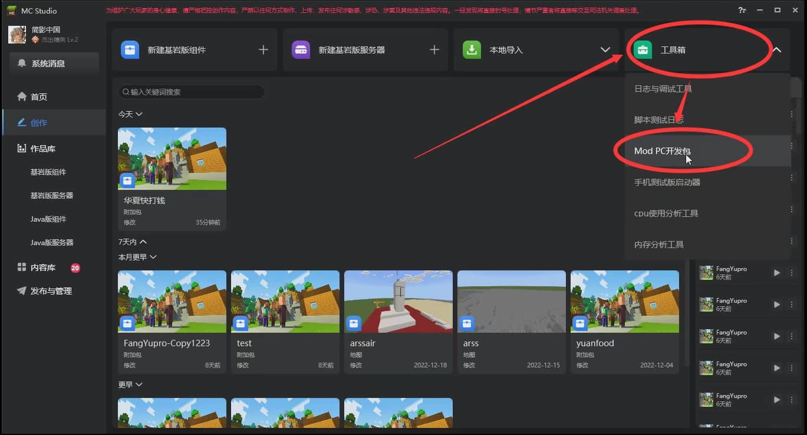

# 蓝图全流程详解

> 本篇教程获得第二期知识库必看教程奖。
>
> 获奖作者：简影中国 氢氧白桦。

首先，非常感谢开发者官网的教程中编写的蓝图编辑器教程，以及在我开发过程中给予帮助的大佬。

但是随着mcstudio的版本更替，相关教程已经显得有些落后且杂乱，都快成为 **萌新看不懂，大佬不想看** 的东西了，故有了本期教程。

如有讲的不对的地方，欢迎在评论区更正！

## 基础知识

虽然说蓝图编辑器是为了不会使用py的开发者小伙伴准备的，但是我们要清楚地认识到，无论是py还是c++，又或者是时常被人看不起的易语言，本质都是编程语言。而编程的核心是从来不是编程语言，而是逻辑。所以说，即使使用蓝图编辑器，使用图形化编程，也请确保本身有一定编程基础，但开发和编程又并不完全一样。另外，编程本身是一项极其枯燥和费脑子的工作，请做好打持久战的准备哦！并且我这里不会讲什么内存地址啥啥啥的东西，就mc开发而言，那玩意百分之90的部分都用不上，等用上再讲也不迟。

1. 变量类型

   在开发初期，我们只需要认识以下变量名称就足矣，剩下的等我们用到了再补充，不然讲多了我们大伙也记不住。

   1. Any

      这个不做解释，当你不知道定义为啥的时候就写它。但我不建议这么干，以为时常会因为变量类型导致节点连不上。

   2. Int

      整数类型，简称整型，用人话说就是整数，用它定义的变量都是整数。

   3. Float

      浮点型，用人话说就是有小数点的数，用它定义的变量都是浮点数。即使定义的是一个“整数”，如2023，也会变成2023.0，这点在编程时需要注意。另外，建议没啥特殊要求就用int，因为同样的数字int比float节约内存，而且可以减少因为小数点出奇奇怪怪bug的概率。

   4. Bool

      布尔型，就是对与错。微软定义0为False（错），1为True（对），当然，因为编程语言的区别或者编译器的区别，可能代之的字符不一样，这里就不详细解释了，因为这玩意用的地方比较少。

   5. Str

      字符串类型，说白了就是一串字。字符串类型的数字，在进行运算前要转换成int或者float才行，如何转换我们后面再讲。

   6. Vector3

      坐标变量，说白了就是三个串在一起的float，分别代表XYZ轴。一般自己创建用不上，大部分是通过合并三维坐标来的。

      

   7. 字典类型

      我其实不大清楚这玩意算不算变量类型，但是也不知道放在哪里讲好，字典就是一个名字（key）对应一个值（value），通过构造字典节点创建。具体内容后面实操的时候我们再讲。

      

2. 环境安装

   [官网教程](https://mc.163.com/dev/mcmanual/mc-dev/mcguide/20-%E7%8E%A9%E6%B3%95%E5%BC%80%E5%8F%91/13-%E6%A8%A1%E7%BB%84SDK%E7%BC%96%E7%A8%8B/2-Python%E8%84%9A%E6%9C%AC%E5%BC%80%E5%8F%91/0-%E8%84%9A%E6%9C%AC%E5%BC%80%E5%8F%91%E5%85%A5%E9%97%A8.html?key=%E7%8E%AF%E5%A2%83&docindex=1&type=0)。

   看完开发环境搭建这一节就好，别的不用管。

   

   为了防止大家下载各种软件麻烦，我为大家整理打包好了，安装请务必按照教程一步步来！！！

   别问我蓝图编辑器不安装环境能不能用，问就是我不清楚，没试过！！！

3. 创建工程和简单操作

   首先创建一个空白附加包。

   

   这里我们需要修改的只有作品名称，别的都不用管。

   

   我们点击作品——>命名空间，修改一个好记的名字。命名空间相当于姓，不要有大写、符号、中文，小写英文组合就行了，花里胡哨的容易出bug，也别信它说什么可以有下划线，我之前就被坑过。

   

   先创建一个预设，起一个好听的名字，要求如命名空间，不过这个可以有数字。

   

   同样，我们创建一个蓝图零件。

   都创建完成后我们可以在主界面看到我们创建的玩意了。

   

   

   我们切换到预设编辑器，点击我们刚刚创建的预设。

   

   我们点击零件，点击我们之前创建的蓝图零件，把它拖到预设上。
   

   我们点击那个空预设，将预加载和常加载勾上，只有这样我们的蓝图才能运行。

   

   最后检查一遍挂载是否成功、加载是否开启。
   

   我们切换到逻辑编辑器节目，也就是我们常说的蓝图编辑器界面，我们会发现我们默认打开的为不可保存的测试蓝图。我们点击资源管理器中的蓝图分类。
   

   点击我们之前创建的蓝图，会发现主界面中多了很多东西，这才是我们要用的蓝图。

   

   那么完成了创建工程之后，我们就可以开始正式的工作了！在主界面右键网格背景可以呼出查找列表，输入响应节点的名称就可以搜索出想要的节点了，长按节点的端口可以拖出连接线，继续拖动可以将连接线连接到其他节点上，点击节点可以看到属性。常用的快捷键如Ctrl+Z撤回，Del删除，在mcstudio里面都是可以正常使用的。

4. 蓝图工作流程。

   蓝图是由节点构成的一种可视化编程方式，网易的蓝图编辑器和虚幻引擎的蓝图编辑器很像。如果您有使用虚幻引擎进行开发的经验，这一段就可以跳过。

   我们都知道，无论是py、c++、蓝图，电脑都是没法直接识别运行的，他们都要转译成010101之类的玩意才能运行，这个过程就是我们常说的编译。

   一段完整的蓝图代码主要是由监听、判断、运行三部分组成，每个部分都是由很多节点串起来的。

   如图所示就是一段简单的蓝图逻辑。

   

   当玩家发送消息的时候，比较发送的消息内容，如果发送的消息是“华夏”，则执行发送“打钱”的消息节点，

   我们发现在蓝图逻辑中，每个节点之间有橙色和蓝色的连接线。橙色的是逻辑连接线，决定的是每个节点之间的执行逻辑。蓝色的是数据连接线，用于在每个节点之间传输数据。

   我们发现，每个节点之间的都只连接了一些端口，还有很多端口是空着的，但其实并不是每一个端口都要连接。我们可以将鼠标移动到节点上，就可以看到技术文档的链接了，技术文档里面会阐明哪些端口是必连的，这里就不再赘述。有些小伙伴可能会问args端口有什么用，这个我只能说没什么用，因为我到现在也没用过这个端口，问了几位大佬也是一样的回答。

   

   监听就是守株待兔，当游戏触发了一个特定的条件的时候，监听节点就会被激活，然后执行后续的逻辑。

   当监听节点被激活后，我们将监听节点获取到的数据进行处理，也就是下一步——判断。我们这里使用“字符串比较”节点判断玩家发送的消息是否是“华夏”，如果是就进入运行接下来的逻辑——发送“打钱”，如果不是就啥也不干。

   需要注意的是，即使玩家在聊天框内输入的是纯数字，但是系统获取到的依然是字符串格式（str）的数字，如果要进行数学运算，就需要在比较之前转化为int或者float类型，这个我们后面再讲。

   现在我们已经完成了一个简单的逻辑，我们现在点击左上角的保存——》运行来看看我们的工作成果吧！其实点击运行就会自动保存，但我有点信不过这玩意，因为mcstudio内测的时候正常出现自动保存失灵的情况。

   

   在版本选择的时候，我们选择 **稳定版** ，如果都是稳定版就选择版本号更新的那个，然后等待启动。

   启动后我们会看到如图的界面，红色框子的是测试工具，紫色框子的是游戏本体。

   

   我们会遇到两种报错，一是弹窗报错，二是在测试工具的日志里面报错。如果看不懂报错的英文，拍照翻译软件是个好东西，实测有道翻译官还行，倒不是它功能有多好用，主要是别家的拍照翻译做的比它还烂。

   我们点击这个按钮可以将日志导出，方便我们与其他开发者交流。如果有解决不了的问题，求助时请务必附上源代码和日志！！！

   我们在聊天框内输入 **华夏** ，会发现系统确实给我们回答了一句打钱，但却是在我们的话之前回答的，难道是因为我们的模组有时空魔法？

   当然不，只是系统会优先响应组件的逻辑，我们可以为我们的逻辑中加入延迟处理，如图。注意，延迟节点在默认下延迟秒数为0，需要手动更改！ 

   我们现在再保存运行，就会发现顺序正常了。

   

   我们保存并关闭编辑器，回到mcstudio主界面。将鼠标指针移动到我们的项目上，点击更多，选择导出就可以了。普通导出就是导出模组，是加密的版本，一般用于发布，这个版本是无法查看和更改源码的。而含编辑信息的导出就是未加密的版本，就是我们常说的源代码，可以查看和更改，一般用于交流学习使用。

   

5. 章末小技巧

   每章末尾我会写一些小技巧，回答大家在开发工作会遇到的一些问题，希望对大家有些帮助。

   1. 本地多人联机测试。

      首先我们进入编辑器，启动运行。将编辑器中的游戏切到后台，打开mcstudio主界面，点击创作界面，点击工具箱，点击ModPC开发包，选择一个和编辑器中游戏一样的游戏版本，点击启动。

      

      之后我们会发现ModPC开发包启动的是一个国际版mc的界面，我们点击游戏。

      

      点击好友，就可以看到我们在编辑器中启动的游戏，点击加入。

      

      点击之后我们就发现在我们的电脑上运行了两个联机的mc，就可以用于多人模式测试了。

   2. 手机版测试。

      首先参加手机版测试的成员需要准备一个使用“163邮箱”注册的正式服游戏账号（一定要163邮箱！！！），并登录正式服等待信息。

      我们打开浏览器，使用开发者主账号登录[我的世界开发者内容管理](https://mcdev.webapp.163.com/#/login)，点击账号管理——》协作成员管理——》添加成员，输入那位成员的游戏id，点击添加成员。

      添加之后那位成员在正式服的游戏消息中会收到开发者协作成员邀请，同意后主账号就可以在后台看到那位成员。我们点击那位成员名字后面的 **发起实名认证** ，之后让那位成员登录[认证网页](https://mcdev.webapp.163.com/#/subAccountAuth)，进行实名认证。

      

      认证通过后我们打开开发者内容管理，在成员管理中点击那个成员后面的权限设置。

      

      给与他测试版启动器登录权限，保存并应用。

      

      之后那位成员便可下载登录测试版启动器参与组件测试。我们可以在开发者内容管理中获取到下载二维码，但QQ频道不让发二维码，请各位自行前往下载。

      

      测试版启动器功能和正式服一样，不过只有将制作的组件提交到作品管理并开启内测后才能在内测服的资源中心内下载。注意，成为开发者协作成员的账号，在正式服会出现在开发者成员列表中，并且在相应组件评论区发言时会有开发成员的标签，相当于一个工作室官方成员的标签认证，要注意防止有人拿着协作账号招摇撞骗，引起损失。

   3. 测试版游戏自定义id。

      在主界面点击账号头像——》设置——》ModPC开发包，可以设置固定的id，不过这个固定id只在ModPC开发包中生效，对于编辑器版本的游戏是不生效的。比如设置成自己工作室的简写或者自己的名字，如我们工作室的简写是SSC（Simple Shadow China Studio 简影中国工作室），在录制实机的时候可以当一个隐藏水印。

      

