# 制作爆炸生物

> 本篇教程获得第二期知识库优秀教程奖。
>
> 获奖作者：云易工作室-Moxuan。

今天来写一个关于生物像苦力怕一样爆炸的行为吧，我们首先还是新建一个名叫爆炸牛牛的附加包吧。

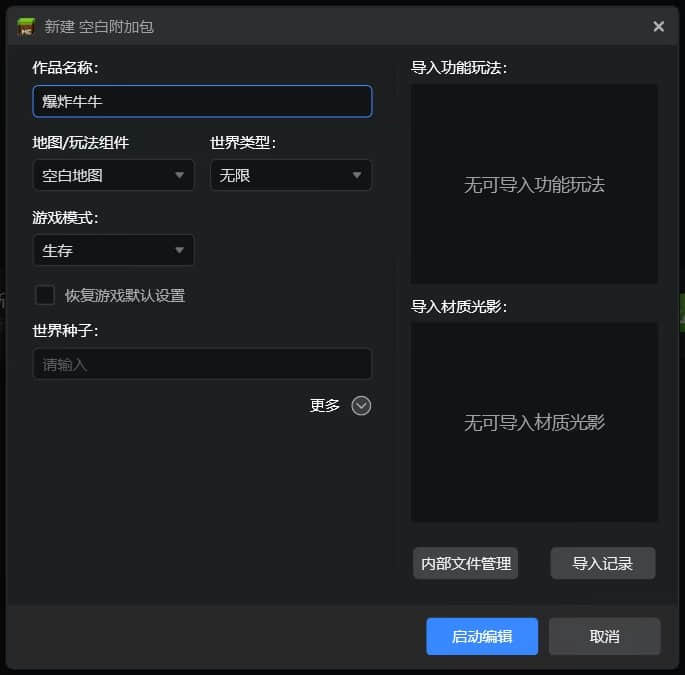


点击启动编辑即可，然后点击新建。

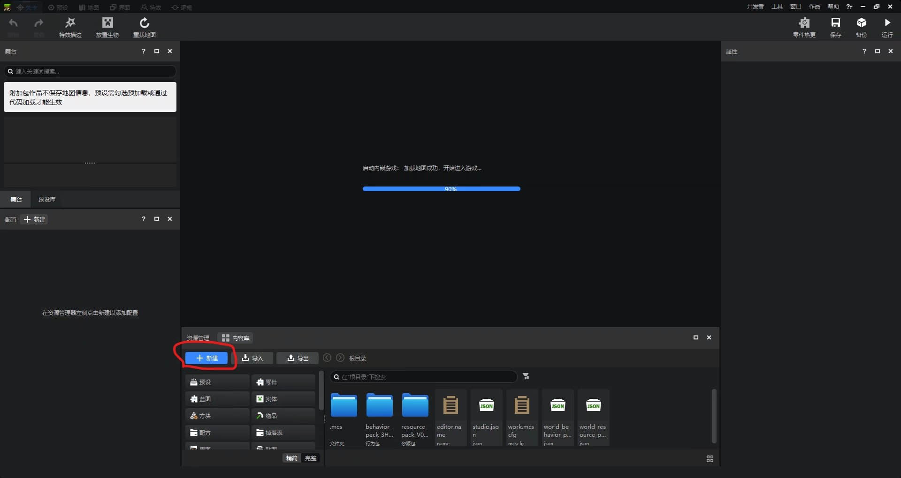


点击左侧配置菜单项，选择实体再点下一步。

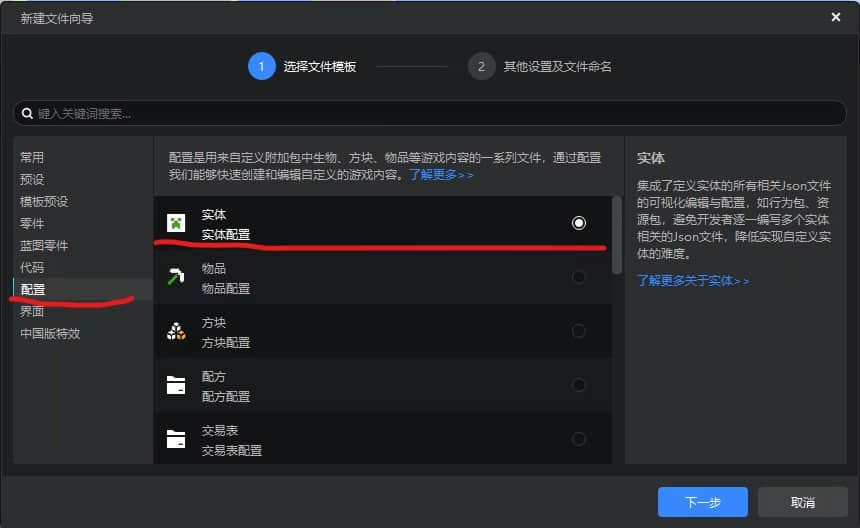


直接点击创建即可。

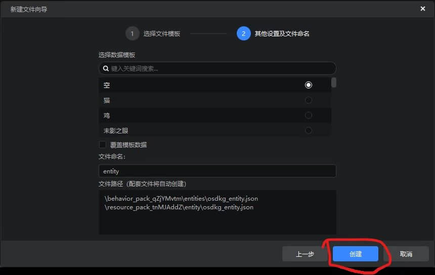


在上方的整体模板中选择牛，然后按右边的对勾应用。

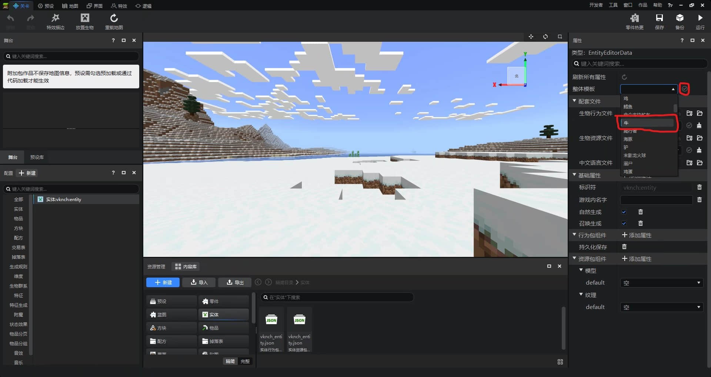


这个时候我们就要为牛牛君添加爆炸行为了，我们首先点击图示圈圈处打开文件。

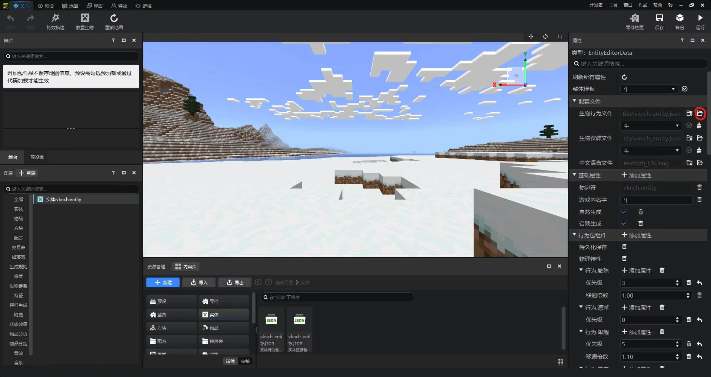


打开行为文件后，先为牛牛添加玩家为攻击者的行为，我们在components里添加这么一段行为组件，这段组件是为牛牛添加了如果在一定范围内有玩家就会对其产生敌意。

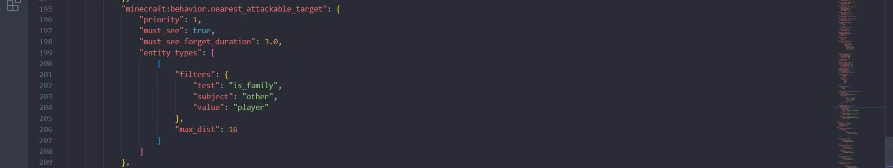


然后为牛牛君添加行为传感器，我们同样也在components里添加这么一段行为组件，这段组件是为牛牛添加了如果有敌意的目标进入一定范围就会触发的相应的事件。

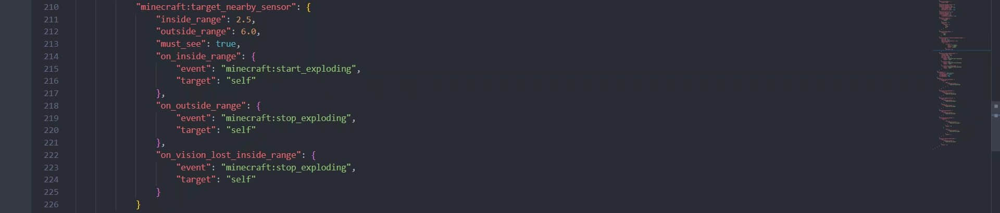


刚刚传感器在玩家进入攻击范围或者离开攻击范围的时候会触发两个事件，一个是minecraft:start_exploding，另一个是minecraft:stop_exploding，我们将这两个事件添加至events。这两个事件分别是添加或者删除生物的额外组件类别。

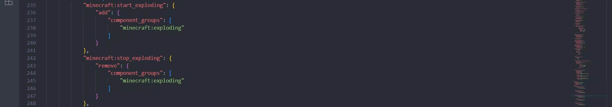


我们在component_groups里添加这个名字叫做minecraft:exploding组件名。

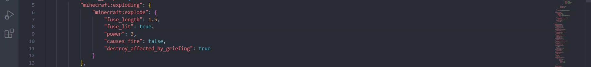


这样子最后就大功告成了！我们最后来看看结果吧！

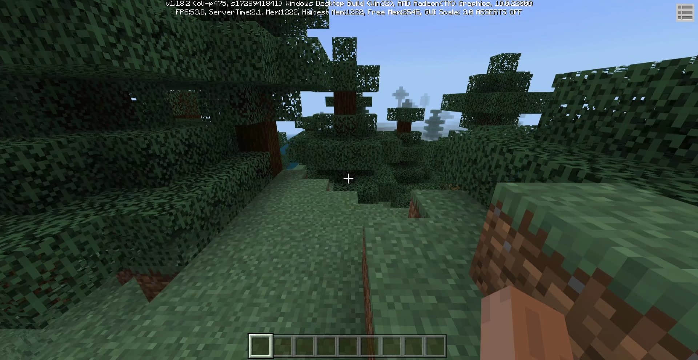


**00:30** 真是被牛牛君炸飞了呢！本次教程由云易工作室MoXuan编写，继续招人哈，下面是精简内容图片和精简内容源码。

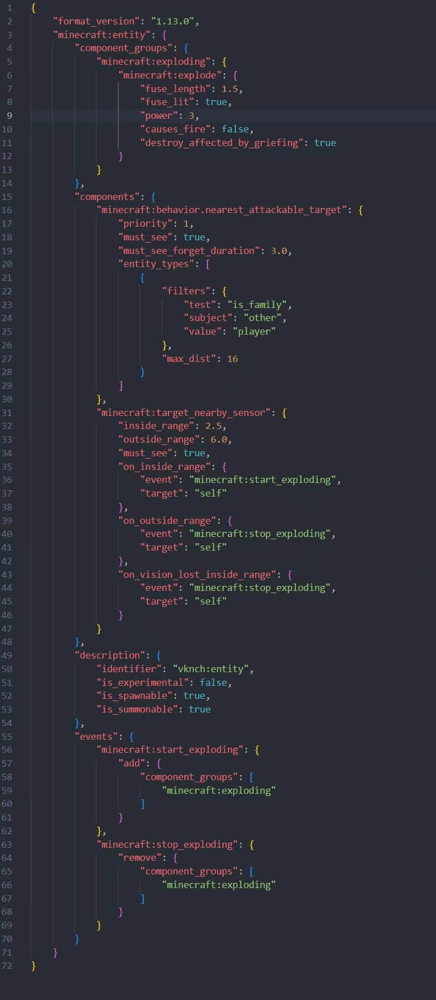


```json
{
    "format_version":"1.13.0",
    "minecraft:entity":{
        "component_groups":{
            "minecraft:exploding":{
                "minecraft:explode":{
                    "fuse_length":1.5,
                    "fuse_lit":true,
                    "power":3,
                    "causes_fire":false,
                    "destroy_affected_by_griefing":true
                }
            }
        },
        "components":{
            "minecraft:behavior.nearest_attackable_target":{
                "priority":1,
                "must_see":true,
                "must_see_forget_duration":3,
                "entity_types":[
                    {
                        "filters":{
                            "test":"is_family",
                            "subject":"other",
                            "value":"player"
                        },
                        "max_dist":16
                    }
                ]
            },
            "minecraft:target_nearby_sensor":{
                "inside_range":2.5,
                "outside_range":6,
                "must_see":true,
                "on_inside_range":{
                    "event":"minecraft:start_exploding",
                    "target":"self"
                },
                "on_outside_range":{
                    "event":"minecraft:stop_exploding",
                    "target":"self"
                },
                "on_vision_lost_inside_range":{
                    "event":"minecraft:stop_exploding",
                    "target":"self"
                }
            }
        },
        "description":{
            "identifier":"vknch:entity",
            "is_experimental":false,
            "is_spawnable":true,
            "is_summonable":true
        },
        "events":{
            "minecraft:start_exploding":{
                "add":{
                    "component_groups":[
                        "minecraft:exploding"
                    ]
                }
            },
            "minecraft:stop_exploding":{
                "remove":{
                    "component_groups":[
                        "minecraft:exploding"
                    ]
                }
            }
        }
    }
}
```

