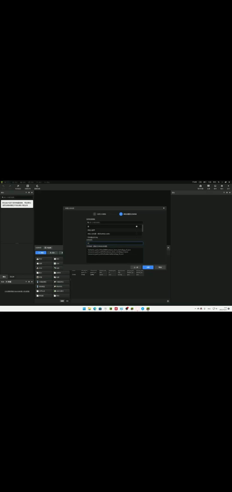
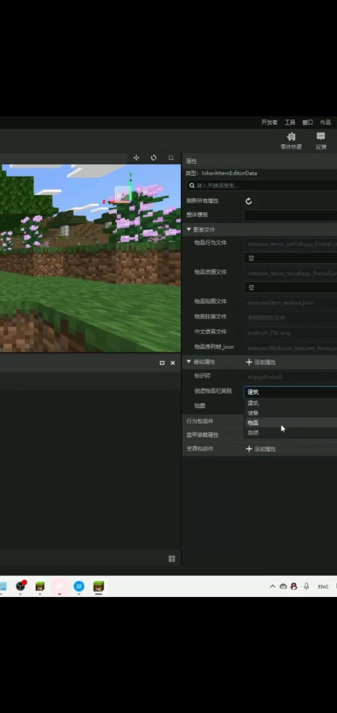
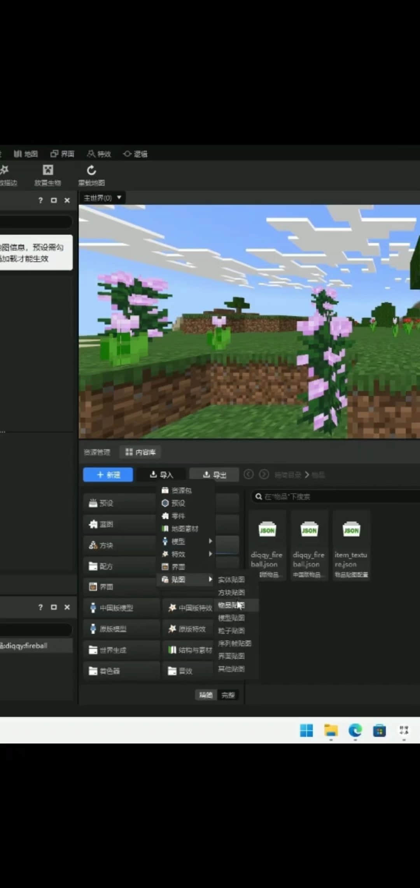
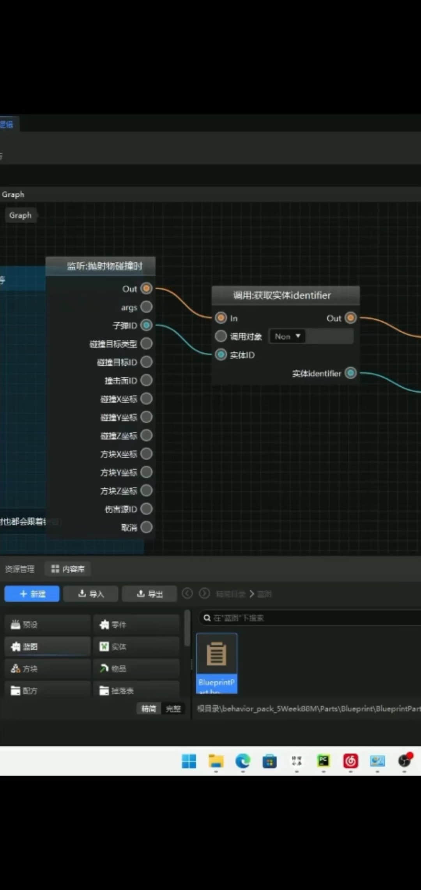
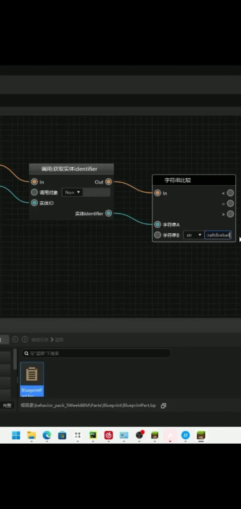
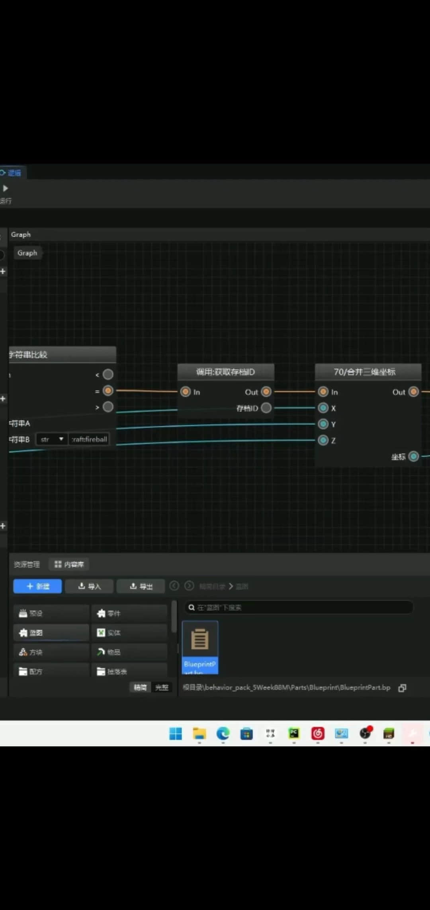
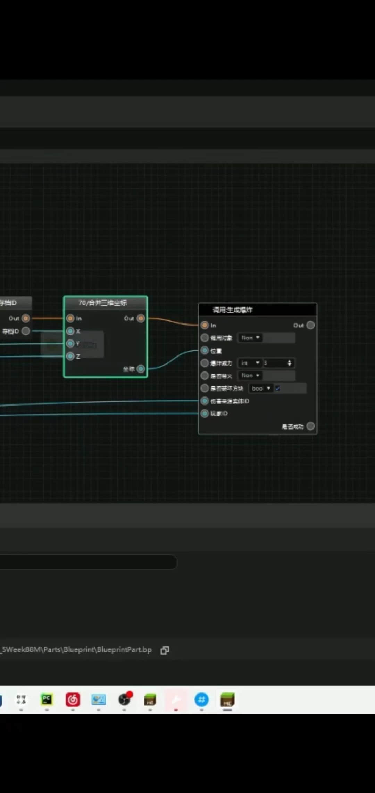
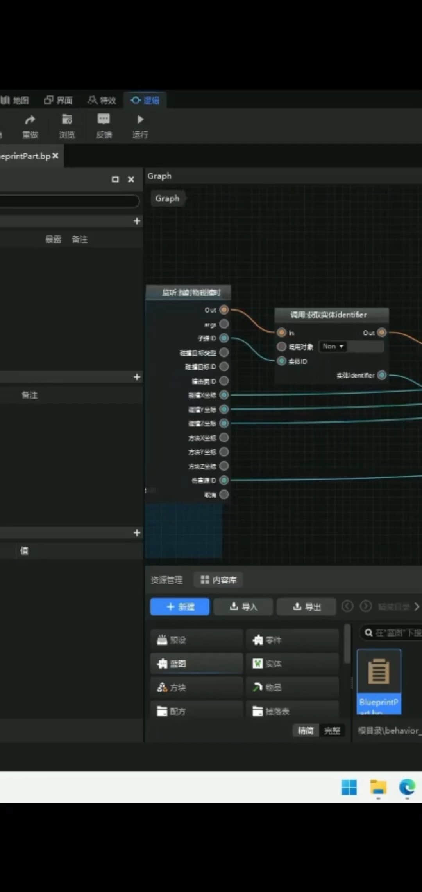

# 可以发射的火焰弹

>本篇教程获得第二期知识库优秀教程奖。
>
>获奖作者：MaShuGG。

**视频教程：**

<iframe frameborder="0" height="600" width="800" allowfullscreen="allowfullscreen" src="http://cc.163.com/v/core/externplayer/63e39aa829279d2f4acfc257/"/>

考虑到视频教程有点听不清我这里在做一个图文：

首先新加一个物品，名字自定义。

然后配置好基础信息 。

把的添加属性的选项全部勾满√ 。

接下来是如何导入原版贴图。

选择物品贴图，跟着下面操作。

导入完成后你就可以在贴图里找到火球的贴图啦~。

再根据上面配置好物品信息就可以了！

接下里就是写蓝图了。

首先创建玩家预设在创建蓝图。

在把零件拖入进去。

点击蓝图，然后打开他！

监听抛射物碰撞。

再来一个字符串比较。

里面填入`minecraft:fireball`，在加入合并三维坐标。

有人问，纳尼?三维坐标是啥。

其实三维坐标就是xyz轴。

咋获取?

你看到了监听事件的碰撞xyz了吗?

批次链接就好了。

有伤害来源实体id和玩家id是啥。

把倒数第二个伤害来源端口链接伤害来源实体id和玩家id。

然后进入游戏测试！

成功！感谢您的观看。

我是麻薯。

