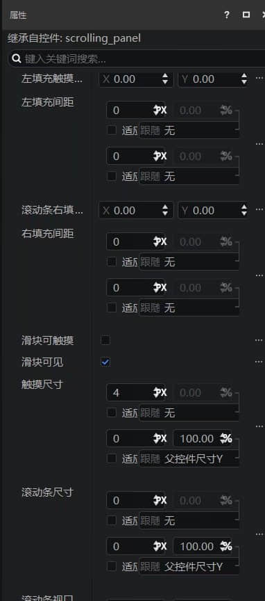

# 制作滚动列表

> 本篇教程获得第一期知识库优秀教程奖。
>
> 获奖作者：个人开发者琅琊少年诸葛恪。

滚动列表是一种可滑动的面板，玩家可以通过上下滑动来调整滚动列表的显示范围。

创建滚动列表，我们首先打开界面编辑器。

找到编辑器中下位置的资源管理面板，点击新建按钮。

选择界面->界面文件。

给界面取一个名字，点击创建。

这样左边的控件结构里就出现了一个main画布，我们点击main，右键->添加对象->滚动列表。

这样一个滚动列表就这么被我们创建出来了，但是这时候滚动列表里面还没有滚动的内容，所以我们需要让里面有能够滚动的东西。

我们以和创建滚动列表同样的方式，创建一个面板，作为滚动列表里面的内容合集。

右键将其添加到**控件库**里，新手可以把控件库理解成一个存储重复使用的UI控件的地方。

双击左下角刚刚创建的自定义控件，进入这个自定义控件的 **单独编辑模式。**

可以看到刚刚创建的面板已经变成了一个自定义控件，我们可以通过右边属性栏来对面板进行操作。

滚动列表的大小如同摄像机的镜头范围，而滚动列表里的内容，就如同演戏场地的大小。由于滚动列表只能上下滚动，所以在尺寸X上，我们将滚动列表和滚动列表里内容（刚刚创建的面板）的X尺寸进行统一。

我们可以点击左上的按钮来回到控件结构菜单。点击左下自定义控件库里刚刚创建出的面板对面板进行调整。

这里我们将两个控件的X尺寸都设为100。将创建的面板Y尺寸设为150，滚动列表Y尺寸设为100，这样子滚动列表呈现的面板内容有100 * 100 像素大小，另外100 * 50的大小可以通过拖拽显示。

确定好大小之后，我们开始定制滚动列表内容的细节。这里创建三个按钮作为示例。实际做模组的时候，你可以随意调整里面的内容。

位移X和位移Y普遍情况下都为0，如果填写了其他数字，则做出来的效果，会根据输入的数字朝着x轴和y轴位移，导致显示内容显示不全的情况。

点击按钮回到控件结构页面，滚动列表里的内容做好了，我们现在把内容放进滚动列表里。

先把刚刚创建的滚动列表内容面板先删了，我们已经将内容放进滚动列表里，没有必要再在屏幕上显示一个重复的内容面板。

自定义控件库里是还存着的，所以不需要纠结删了白做了怎么办。

点击滚动列表，在右边属性栏编辑，滑倒下面变量区，点击滑动内容下拉框，选择刚刚编辑的自定义控件。

选择完毕之后，我们可以看见已经显示出了内容，但是仔细看，有一部分被滑块挡住，没法完全显示。

这时我们有两种方法可以解决这个问题。

第一种，将滚动列表调整尺寸X，让内容完全展现出来。

第二种，我们找到属性->变量默认区。将左填充间距，右填充间距和滚动条尺寸全部设为0。这样滑块就隐形了，整个滚动列表里的内容就被完整显示出来了。

我们保存一下，进行测试。

可以看到我们的滚动列表已经正常运作了。我们接下来给他进行控件的点击 **监听** 。

创建UI脚本文件：

由于滚动列表的路径可能在不同操作模式下有所不同(是否在 PC 模式下是两种不同的路径如果写死可能会导致控制台报错，玩家无法操作滚动列表），所以我们使用滚动列表的函数进行获取

GetScrollViewContentPath()函数可以获取到滚动列表的内容路径。
当我们获取到内容路径之后,我们就可以对其中的三个按钮添加点击后执行的代码

测试一下，没有报错和bug

就这样我们非常轻松地添加了一个滚动列表。