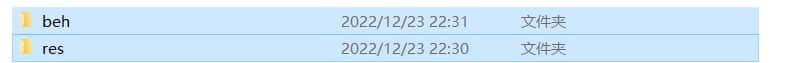

# 错误代码6的常见问题和解决方案

>本篇教程获得第二期知识库优秀教程奖。
>
>获奖作者：浊酒。

近期发现较多小伙伴在上传组件时遇到了错误代码6不知道如何解决，虽然官方有《资源上传规则》，但并未讲明白常见的几种情况，且有歧义。本篇仅针对玩法和材质的打包，因为这两种组件是出现错误频率最高的。

**约定：**

**为方便表述，本篇内将资源包(resource_packs)文件夹称为res文件夹，行为包(behavior_packs)文件夹称为beh文件夹，实际情况下这两个包的名字你可以在符合文件名规则的情况下随便取。**

## 关于文件

### 检查你的文件夹

官方识别资源包的依据是res文件夹内是否含有**textures**文件夹，识别行为包的依据是beh文件夹内是否含有**entities**文件夹，即使你不需要，也需要创建一个空文件夹进行命名， **请优先检查文件夹是否正确。**

### 文件名规则

无论何时， **不要在任何文件名或文件夹名中使用中文和空格** ，如果你不清楚具体的规则，建议只使用A-Z，a-z，0-9和英文符号“ _ ”。 **同时，不可使用resource_packs及behavior_packs作为名称。**

## 如何打包

### 玩法的打包

无论你需不需要， **玩法必须包含资源包和行为包** ，如图所示，按住shift键依次点选两个文件夹，确保它们都变成了被选中的蓝色，并且 **确保只选择了这两个文件夹** ，在其上右键选择添加到压缩文件，设置好你需要的格式后压缩，打包就完成了。

*务必确保没有选择多余的文件，之前mcs发布的作品会携带一些地图的文件导致上传失败。*

### 材质的打包

*建议在打包前去除包内未修改的材质，避免占用过多空间。*

单击res文件夹，在其上右键选择添加到压缩文件，设置好你需要的格式后压缩，打包就完成了。

**请注意，res文件夹打开后应当直接可以看见textures文件夹，中间并无多余的嵌套。**