# 利用C4D渲染的简单案例

> 本篇教程获得第二期知识库必看教程奖。
>
> 获奖作者：脚丫。

## 目录

1. 前言。
2. 渲染器的简单介绍。
3. Blockbench导出模型。
4. C4D导入模型。
5. C4D基础操作。
6. 微调材质。
7. 添加地面和背景。
8. 添加灯光和阴影。
9. 全局设置。
10. 图片输出设置。
11. 后记。

## 前言

本人并非专业的后期制作者，仅因兴趣偶尔制作。本文会简单的对blockbench模型进行简单无缝场景渲染，由此展开基础渲染的介绍与教程。

把渲染做好并不是一件容易的事情加以图文的限制，本文会舍弃一些不怎么重要的设置。虽尽量标准清楚，但依旧可能有遗漏的地方。如您对渲染有兴趣学习，请移步更大的平台进行学习，bilibil搜索”朝曦asahi”，这位的教程非常详细。

## 渲染器的简单介绍

[Rendering Models - Blockbench Wiki](https://www.blockbench.net/wiki/guides/model-rendering/)中提供了4种对模型的简单渲染办法。其中最难的一种，但质量最好一种是利用blender进行渲染，但本人对blender并没有深入的了解，这里便提及另一种渲染器—C4D。

C4D物理渲染器上手简单，并且效果也较为优良。它对Adobe非常友好，可以进行多通道渲染，再将其直接导入ae、ps进一步制作细节。

同时C4D可以导入众多渲染器，如OC、Arnold，这些渲染器的效果更加优秀且高效。

以下C4D使用版本为R19，大家可以自行网上下载安装，或私聊我获得安装包。

## Blockbench导出模型

进入blockbench，选择“文件-导出”，在这里我们选择导出glTF模型。

有人问为什么不导出obj模型，因为gltf模型可以导出自带的模型枢轴和动画。

有些人可能会遇到导出的gltf不带动画，因为gltf动画名称，需要设置它可以识别的，如“walk”（这里并未找到详细资料，walk是一定可以成功绑定到模型的）。

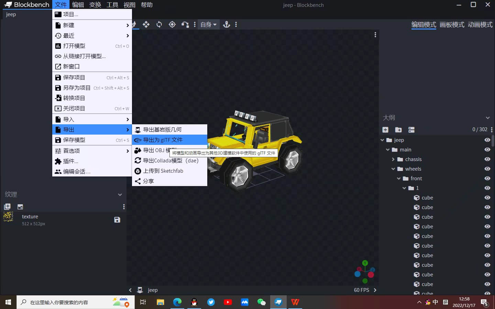

## C4D导入模型

在导入gltf模型之前，还需要将模型转为ADE模型，因为C4D并不能导入gltf模型。

这里推荐使用blender进行转换（blender功能众多，这也是为什么越来越多的人选择使用blender）。需要注意的是，blender导出ADE模型的路径必须是全英文，否则后续需要在C4D里进行微调uv贴图。

进入C4D，选择“文件-打开”，即可进行选择模型路径导入。

## C4D基础操作

鼠标左键进行选择，鼠标滚轮进行缩放，按住alt再摇晃标左键进行视角移动。

新手可能会非常不顺手，可以在设置里选择用“WASD”进行移动，但我非常不建议这么做。

## 微调材质

现在看模型材质会非常模糊，鼠标左键双击材质球，将采样改为“无”，即可清晰。

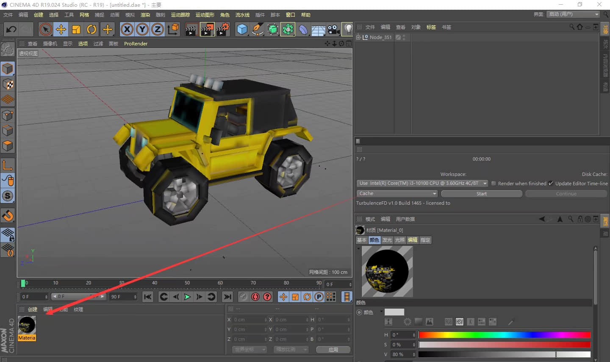

这时贴图的空白部分会显示黑色，需要选择alpha，纹理改为“位图”，同样采样改为“无”。

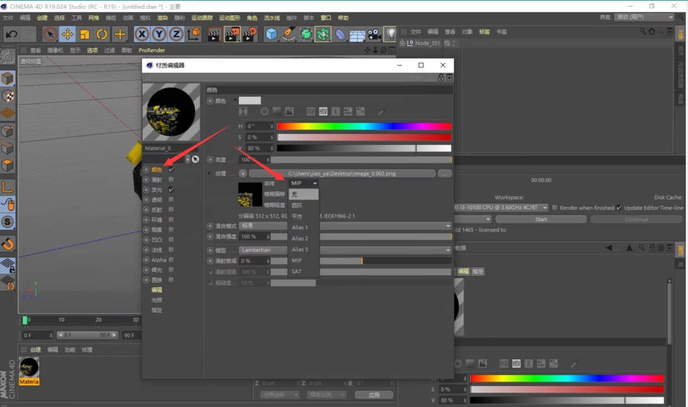

## **添加地面和背景**

鼠标左键长按地面，即有更多选项，鼠标单击添加。

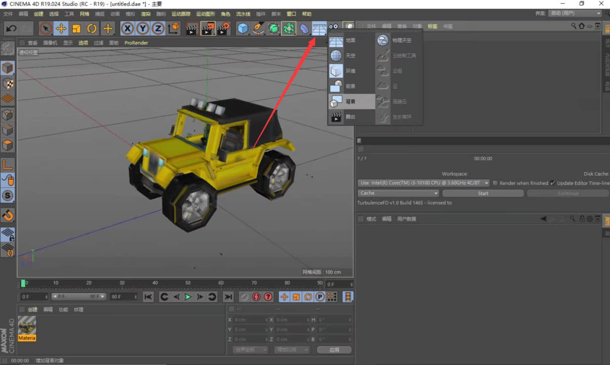

双击下方空白处，会自动创建材质球，可以鼠标拖动材质到地面和背景。

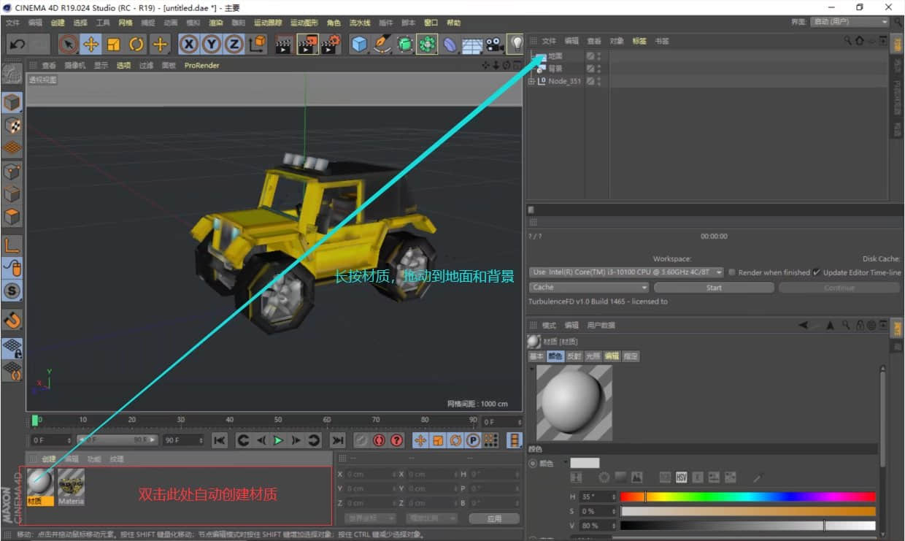

接下来这步是创建无缝环境的重点，操作略微繁琐，采用视频格式呈现。

<iframe frameborder="0" height="600" width="800" allowfullscreen="allowfullscreen" src="http://cc.163.com/v/core/externplayer/63e39c3a308c57165bcfd49e/"/>

## 添加灯光和阴影

鼠标左键添加灯光并移动至自己想要的位置，在右下角可以编辑灯光具体参数。

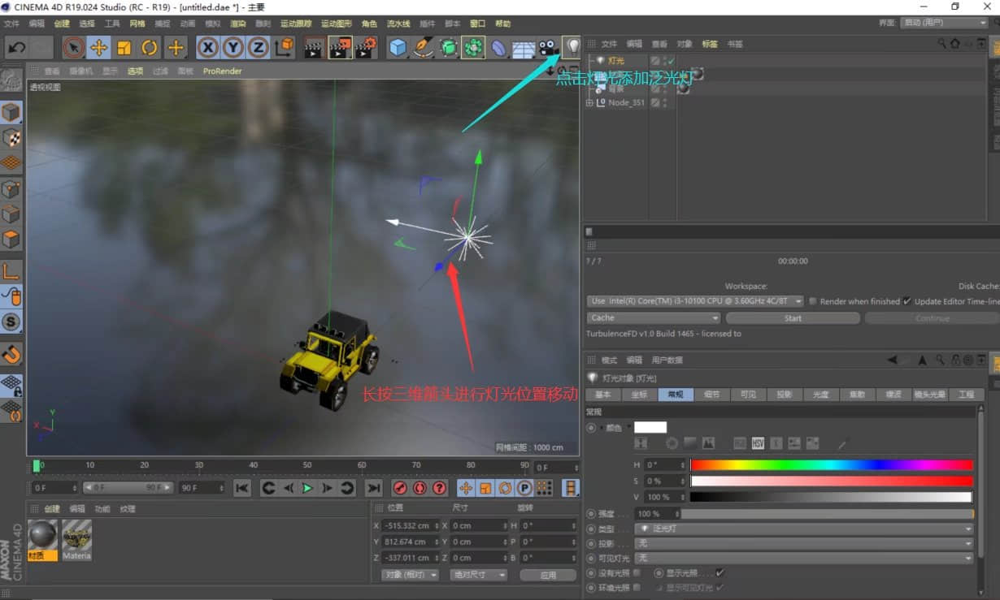

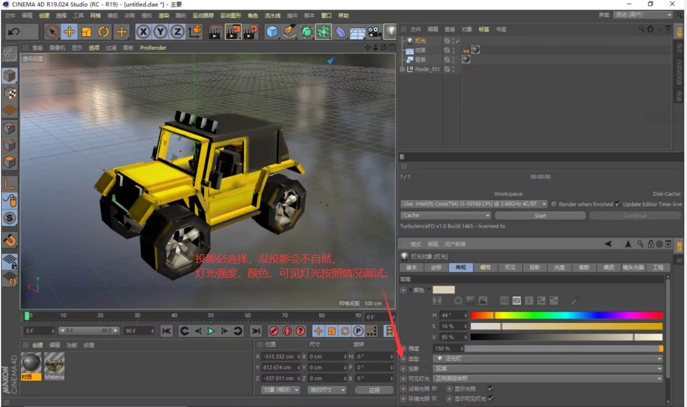

## 全局设置

对全局设置，全局光照一定要添加，这个可以很好的模拟灯光的反射。至于其他的设置并没有那么重要，可以根据实际情况调整。

在这里我们简单添加一个全局光照，操作如下：先打开渲染设置，点击“效果-全局光照”。

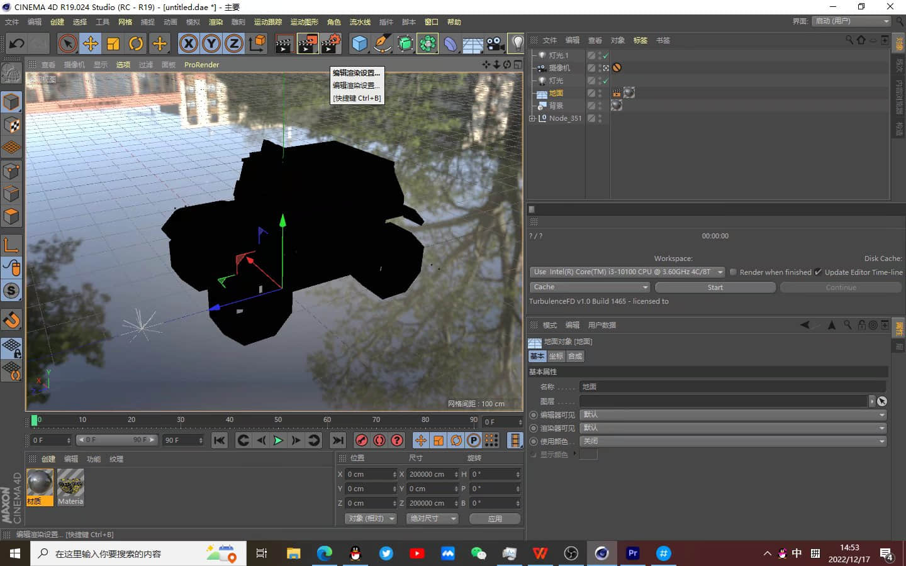

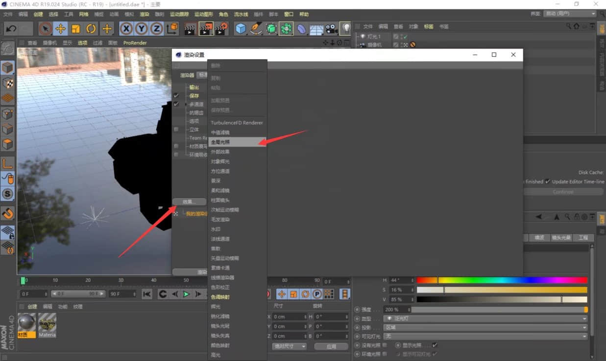

## 图片输出设置

根据中国版icon的规定，icon分辨率应在1000*1000。我们进入渲染设置，将宽度和长度改为1000。

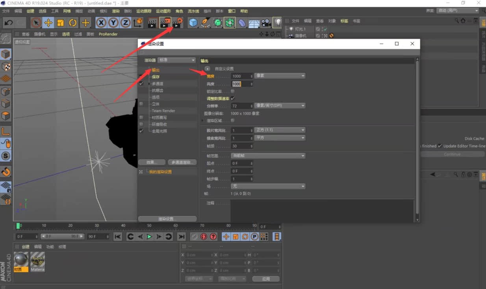

至此，一个简单的模型渲染设置工作完成了。点击渲染渲染到图片查看器，等待渲染完成，点击保存，即可完成成渲染。

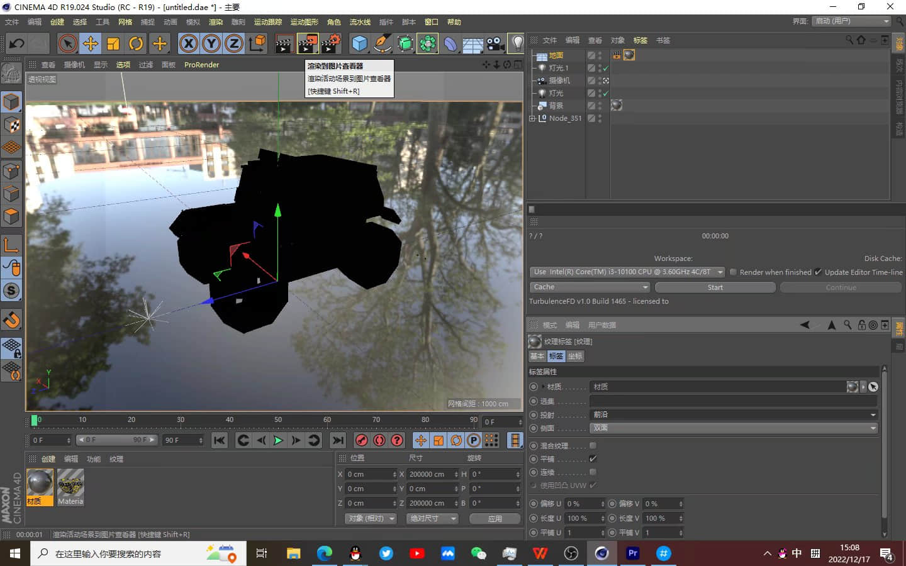

## 后记

渲染确实是比较繁琐的，本文忽略了很多设置，甚至没有添加摄像头，尽量呈现给大家一种简便的方案。实际C4D可以做的细节很多，比如给车灯添加发光效果，车玻璃添加反射。

如果渲染视频，其实也和图片没有什么区别：先添加摄像机，然后像制作blockbench动画一样拖动关键帧，最后在设置里输出视频。

C4D也不仅仅能够渲染模型，地图、皮肤一样可以渲染，并且步骤大同小异。下面给大家展示一些简单的渲染图片。

这个是C4D物理渲染器制作的简单皮肤渲染

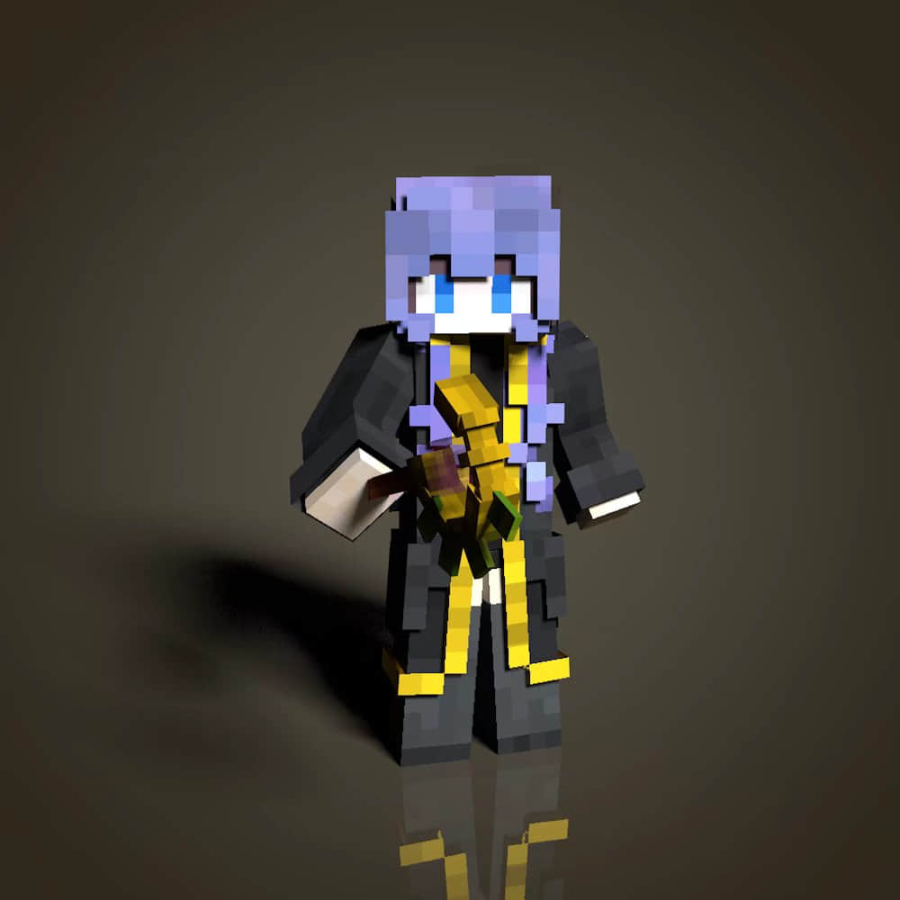

这个是C4D-Arnold制作的简单模型渲染，模型来自无名...

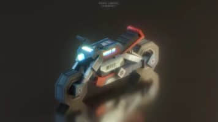

这个是C4D-Arnold制作的建筑渲染

希望这篇帖子可以激起大家对渲染的兴趣，并找到更多的资料学习渲染。