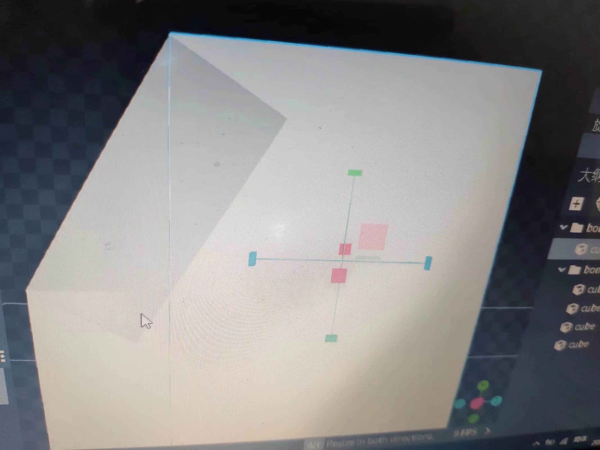

# 处理模型重叠

> 本篇教程获得第一期知识库优秀教程奖。
>
> 获奖作者：仙君御。

我们可以看到这里的两个块重合。

虽然在blockbench里的预览效果看问题不大。

但是实际上进入游戏后模型渲染将十分难看。

重合的阴影部分会不断闪烁，那么我们开发者应该如何处理这个问题呢？

## 方法一

当两个块的颜色相同时，阴影就不会太明显。

## 方法二

缩放或者调整尺寸相差0.002 以上。适用于实体模型和方块模型（未实验）。

## 方法三

两个模型至少预留0.2的间隙。