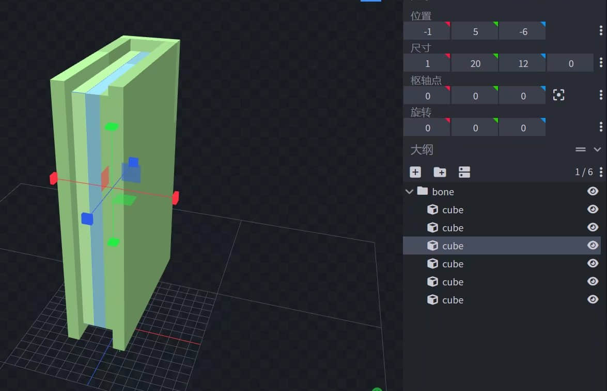
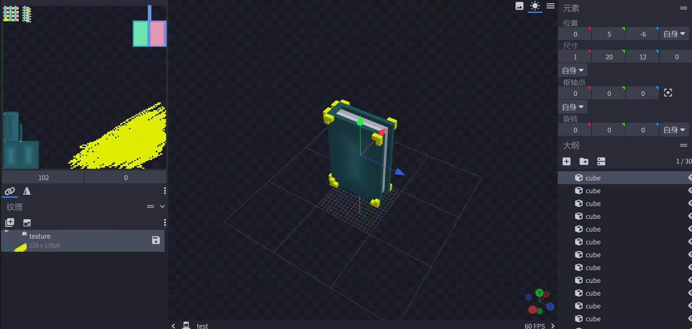
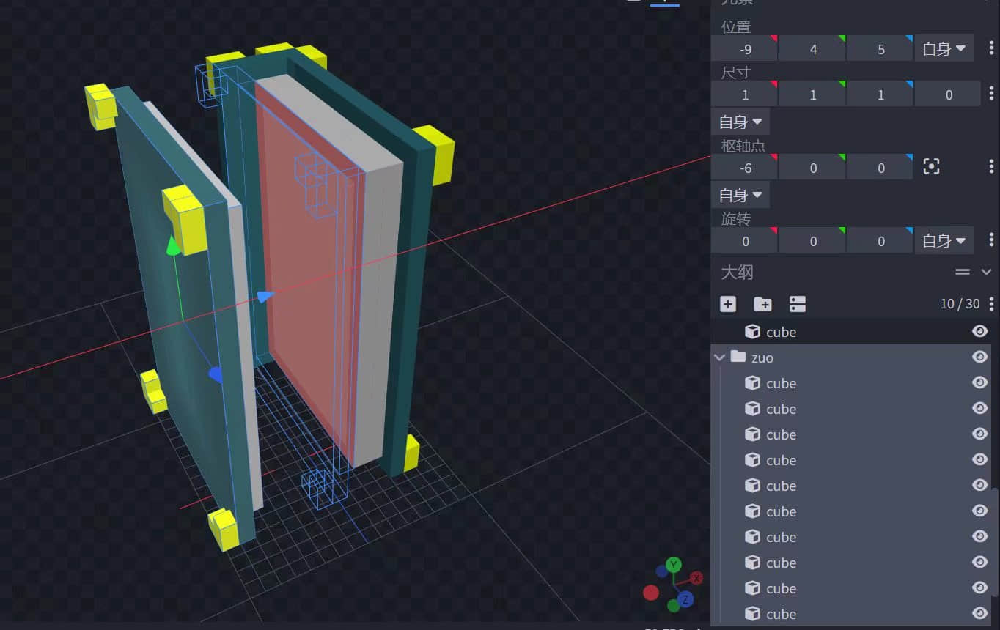
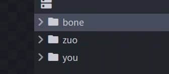
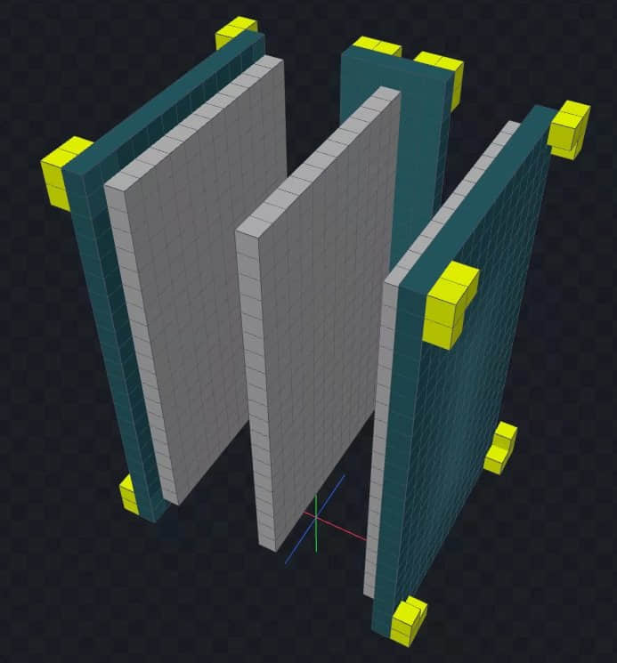
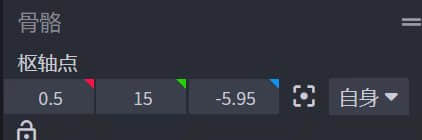
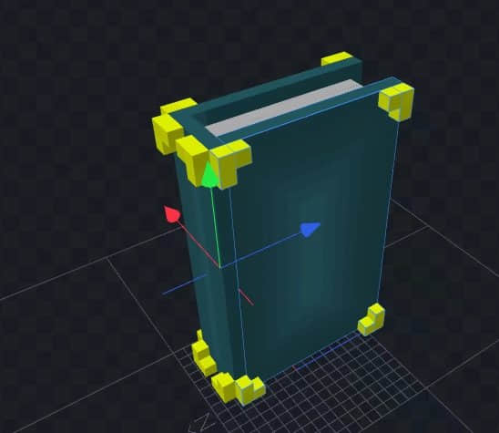
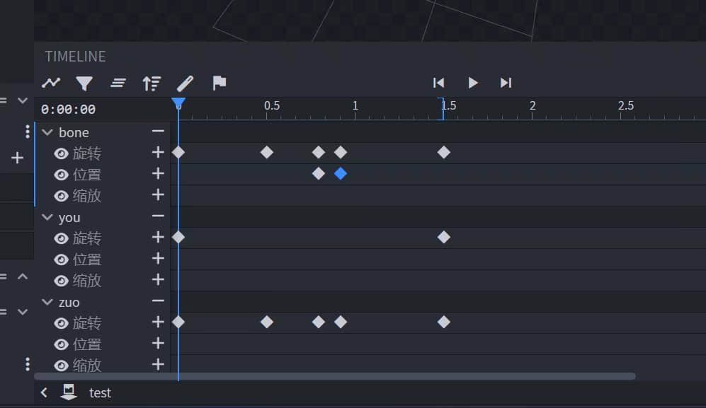

# bb动画与模型制作

>本篇教程获得第二期知识库必看教程奖。
>
>获奖作者：缔造STUDIO-Anymagic。

考虑到有些开发者基本上没有摸过blockbench，但是现在的模组基本离不开模型，考虑了一下用了几个小时做了这个教程，仅供参考，本人也是菜鸡。

进入blockbench，就可以开始建模了。本章不是主要讲建模就一笔带过了，随便做了个模型。

建好模型之后，我们为他创建贴图并且绘制。

画完图之后，我们因为要做书本翻开的动画，那么就把书本分为左页，中间，右页来进行分组。

分组示意图。

然后我们来到动画编辑界面。首先新建一个动画文件，选择循环播放。

翻书的动画是围绕中间来翻的，那么我们就将设置在中间。

然后就开始k关键帧，首尾的关键帧记得k成一样的，这样动画才会连接起来。

这就是最后的动画。书本缓慢打开再快速关闭。保存下来即可。